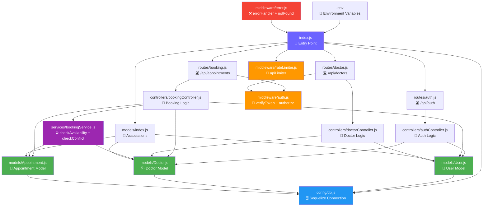
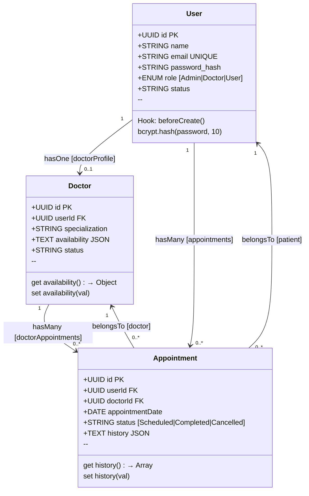
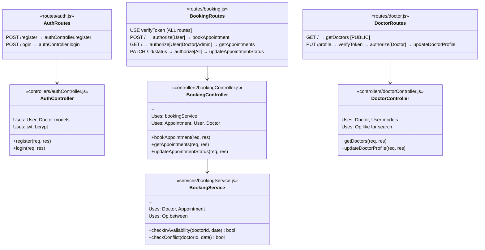
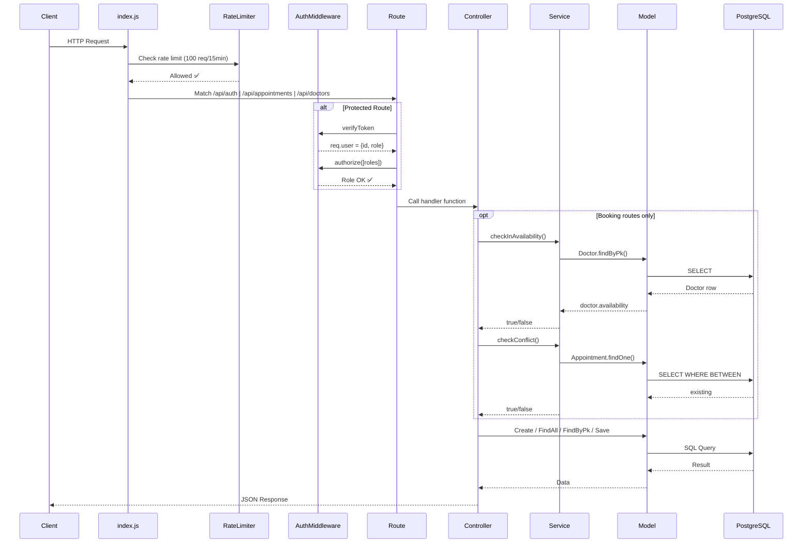

# 🏗️ Backend Architecture — Class & File Diagrams

> **Doctor Appointment System** — Express.js + Sequelize + PostgreSQL

---

## 1. 📦 Full File Dependency Map



---

## 2. 🗂️ Class Diagram — Models & Their Relationships



---


## 3. 🔐 Middleware Class Diagram

```mermaid
classDiagram
    class AuthMiddleware {
        <<middleware/auth.js>>
        +verifyToken(req, res, next)
        +authorize(roles[]) middleware
        --
        Reads: Authorization header
        Verifies: JWT_SECRET
        Sets: req.user ← {id, role}
    }

    class ErrorMiddleware {
        <<middleware/error.js>>
        +errorHandler(err, req, res, next)
        +notFound(req, res, next)
        --
        Uses: config/logger
        Returns: JSON error + stack
    }

    class RateLimiter {
        <<middleware/rateLimiter.js>>
        +apiLimiter middleware
        --
        windowMs: 15 min
        max: 100 requests/IP
        Status: 429 on exceed
    }

    AuthMiddleware ..> "routes/booking.js" : guards
    AuthMiddleware ..> "routes/doctor.js" : guards
    RateLimiter ..> "index.js" : applied to /api/*
    ErrorMiddleware ..> "index.js" : global handler
```

---
## 4. 🛣️ Routes → Controllers → Services Flow



---

## 5. 🌐 Request Lifecycle — How a Request Flows



---

## 6. 🗄️ Database Table Layout

| Table | Key Columns | Foreign Keys |
|-------|------------|--------------|
| **Users** | `id (UUID PK)`, `name`, `email (UNIQUE)`, `password_hash`, `role (Admin/Doctor/User)`, `status` | — |
| **Doctors** | `id (UUID PK)`, `userId`, `specialization`, `availability (JSON)`, `status` | `userId → Users.id` |
| **Appointments** | `id (UUID PK)`, `userId`, `doctorId`, `appointmentDate`, `status (Scheduled/Completed/Cancelled)`, `history (JSON)` | `userId → Users.id`, `doctorId → Doctors.id` |

---

## 7. 📁 File-by-File Import Map

| File | Imports From |
|------|-------------|
| [`index.js`](file:///d:/Backend/index.js) | `express`, `cors`, `dotenv`, `config/db`, `routes/auth`, `routes/booking`, `routes/doctor`, `middleware/rateLimiter`, `models/` |
| [`config/db.js`](file:///d:/Backend/config/db.js) | `sequelize`, `.env` |
| [`models/User.js`](file:///d:/Backend/models/User.js) | `sequelize`, `bcryptjs`, `config/db` |
| [`models/Doctor.js`](file:///d:/Backend/models/Doctor.js) | `sequelize`, `config/db` |
| [`models/Appointment.js`](file:///d:/Backend/models/Appointment.js) | `sequelize`, `config/db` |
| [`models/index.js`](file:///d:/Backend/models/index.js) | `models/User`, `models/Doctor`, `models/Appointment` |
| [`routes/auth.js`](file:///d:/Backend/routes/auth.js) | `express`, `controllers/authController` |
| [`routes/booking.js`](file:///d:/Backend/routes/booking.js) | `express`, `controllers/bookingController`, `middleware/auth` |
| [`routes/doctor.js`](file:///d:/Backend/routes/doctor.js) | `express`, `controllers/doctorController`, `middleware/auth` |
| [`controllers/authController.js`](file:///d:/Backend/controllers/authController.js) | `models/` (User, Doctor), `jsonwebtoken`, `bcryptjs` |
| [`controllers/bookingController.js`](file:///d:/Backend/controllers/bookingController.js) | `models/` (Appointment, User, Doctor), `services/bookingService` |
| [`controllers/doctorController.js`](file:///d:/Backend/controllers/doctorController.js) | `models/` (Doctor, User), `sequelize` (Op) |
| [`middleware/auth.js`](file:///d:/Backend/middleware/auth.js) | `jsonwebtoken` |
| [`middleware/error.js`](file:///d:/Backend/middleware/error.js) | `config/logger` |
| [`middleware/rateLimiter.js`](file:///d:/Backend/middleware/rateLimiter.js) | `express-rate-limit` |
| [`services/bookingService.js`](file:///d:/Backend/services/bookingService.js) | `models/Appointment`, `models/Doctor`, `sequelize` (Op) |
