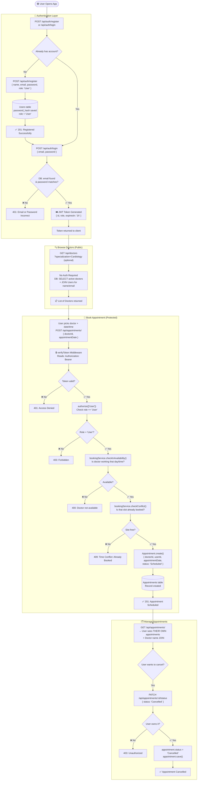
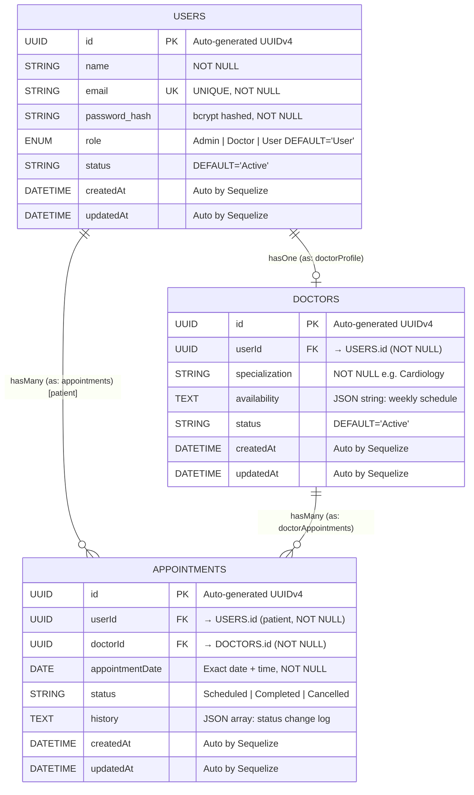
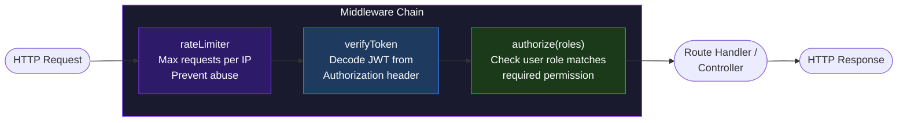

# 🏥 Doctor Appointment System — Flow Diagrams

---

## 1. 👤 User Flow: Login → Book Appointment

---

## 2. 🩺 Doctor Flow: Create Account → Manage Profile & Slots

```mermaid
flowchart TD
    A([🟢 Doctor Opens App]) --> B

    subgraph REGISTER ["📝 Doctor Registration"]
        B["POST /api/auth/register\n{ name, email, password,\n  role: 'Doctor',\n  specialization: 'Cardiology' }"]
        B --> C["User.create()\nrole = 'Doctor'\npassword_hash auto-hashed\nvia beforeCreate hook"]
        C --> C1[(Users table\nNew row created)]
        C1 --> D{role == 'Doctor'?}
        D -- ✅ Yes --> E["Doctor.create()\n{ userId: user.id,\n  specialization: 'Cardiology',\n  availability: default 9-5 all days }"]
        E --> E1[(Doctors table\nNew row created\nuserId = FK → Users.id)]
        E1 --> F[✅ 201: User Registered Successfully]
    end

    subgraph LOGIN ["🔐 Doctor Login"]
        F --> G["POST /api/auth/login\n{ email, password }"]
        G --> H["DB: Find user by email\nbcrypt.compare(password, hash)"]
        H --> I["🎟️ JWT Token Generated\n{ id: user.id, role: 'Doctor' }"]
        I --> J[Token stored client-side]
    end

    subgraph PROFILE ["✏️ Update Doctor Profile"]
        J --> K["PUT /api/doctors/profile\nAuthorization: Bearer <token>\n{ specialization, availability }"]
        K --> L["🔒 verifyToken Middleware\nDecodes JWT → req.user.id, req.user.role"]
        L --> M["Doctor.findOne({ userId: req.user.id })"]
        M --> N{Doctor profile exists?}
        N -- ❌ No --> O[404: Doctor profile not found]
        N -- ✅ Yes --> P["Update fields:\ndoctor.specialization = new value\ndoctor.availability = new schedule JSON"]
        P --> Q["doctor.save()\nAvailability stored as JSON string in DB"]
        Q --> R[✅ Doctor profile updated]
    end

    subgraph SLOTS ["📆 Availability Slots Format"]
        R --> S["availability JSON structure:\n{\n  Monday: ['09:00-17:00'],\n  Tuesday: ['09:00-17:00'],\n  Wednesday: ['09:00-17:00'],\n  Thursday: ['09:00-17:00'],\n  Friday: ['09:00-17:00'],\n  Saturday: ['09:00-17:00'],\n  Sunday: []\n}"]
    end

    subgraph APPOINTMENTS ["📋 View Doctor's Appointments"]
        S --> T["GET /api/appointments/\nAuthorization: Bearer <token>"]
        T --> U["verifyToken → role = 'Doctor'"]
        U --> V["Doctor.findOne({ userId: req.user.id })\n→ get doctorProfile.id"]
        V --> W["Appointment.findAll({ doctorId: doctorProfile.id })\n+ JOIN Users table → patient name & email"]
        W --> X[📋 All appointments for this doctor]
        X --> Y{Update appointment status?}
        Y -- Yes --> Z["PATCH /api/appointments/:id/status\n{ status: 'Completed' or 'Cancelled' }"]
        Z --> AA{This doctor owns appointment?}
        AA -- ❌ No --> AB[403: Unauthorized]
        AA -- ✅ Yes --> AC["appointment.status = new status\nappointment.save()"]
        AC --> AD[✅ Status Updated]
    end
```

---

## 3. 🗄️ Database Relationship Diagram (ERD)

---

## 4. 🔗 Table Relationship Summary

| Relationship | Type | Foreign Key | Description |
|---|---|---|---|
| **Users → Doctors** | One-to-One (`hasOne`) | `Doctors.userId → Users.id` | Each Doctor user has exactly **one** Doctor profile |
| **Users → Appointments** | One-to-Many (`hasMany`) | `Appointments.userId → Users.id` | One patient can have **many** appointments |
| **Doctors → Appointments** | One-to-Many (`hasMany`) | `Appointments.doctorId → Doctors.id` | One doctor can have **many** appointments |

---

## 5. 🏗️ Middleware & Security Pipeline

---

## 6. 📡 Complete API Endpoint Map

| Method | Endpoint | Auth? | Roles Allowed | Controller |
|---|---|---|---|---|
| `POST` | `/api/auth/register` | ❌ Public | Anyone | `authController.register` |
| `POST` | `/api/auth/login` | ❌ Public | Anyone | `authController.login` |
| `GET` | `/api/doctors` | ❌ Public | Anyone | `doctorController.getDoctors` |
| `PUT` | `/api/doctors/profile` | ✅ JWT | Doctor only | `doctorController.updateDoctorProfile` |
| `POST` | `/api/appointments/` | ✅ JWT | User only | `bookingController.bookAppointment` |
| `GET` | `/api/appointments/` | ✅ JWT | User, Doctor, Admin | `bookingController.getAppointments` |
| `PATCH` | `/api/appointments/:id/status` | ✅ JWT | User, Doctor, Admin | `bookingController.updateAppointmentStatus` |

---

## 7. 🔑 Role-Based Access Control Matrix

| Action | User (Patient) | Doctor | Admin |
|---|---|---|---|
| Register / Login | ✅ | ✅ | ✅ |
| Browse Doctors | ✅ | ✅ | ✅ |
| Book Appointment | ✅ | ❌ | ❌ |
| View Appointments | ✅ Own only | ✅ Own patients | ✅ All |
| Cancel Appointment | ✅ Own only | ❌ | ✅ Any |
| Mark Completed/Cancelled | ❌ | ✅ Own appointments | ✅ Any |
| Update Doctor Profile | ❌ | ✅ Own profile | ❌ |
